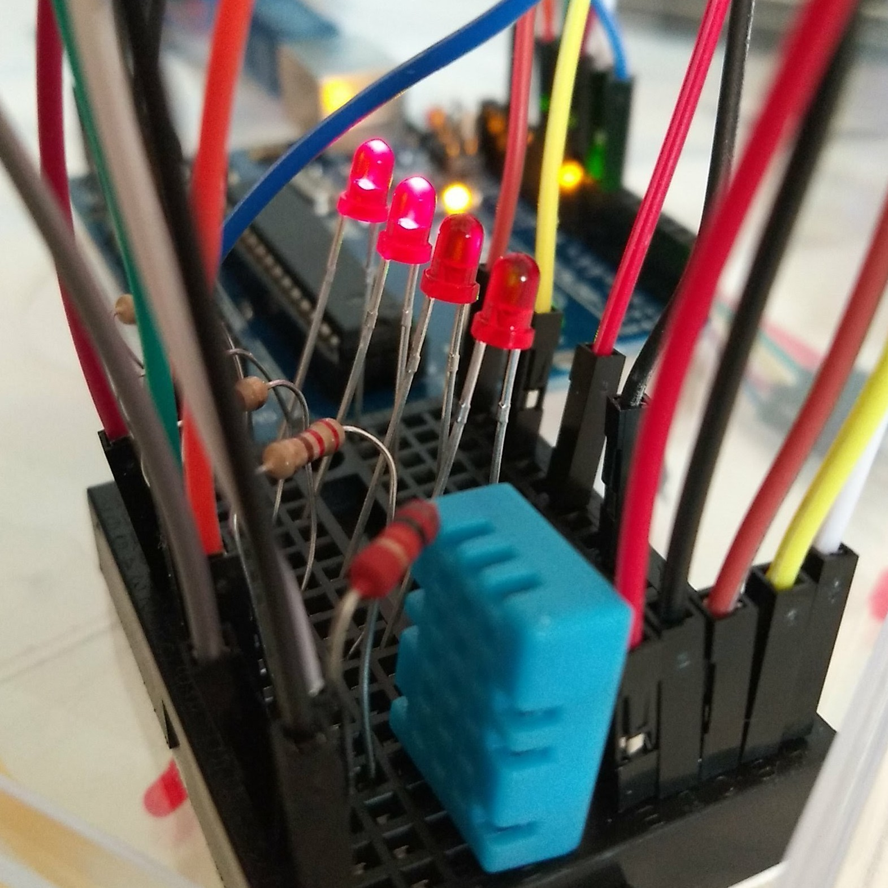

# HumidityLevel

Shows relative humidity level, reading it from a DHT11 sensor with [this library](https://github.com/adafruit/DHT-sensor-library).

Humidity level is shown using LEDs as a progress meter, using [another library](https://github.com/randrade23/LEDProgress) (developed by me).

